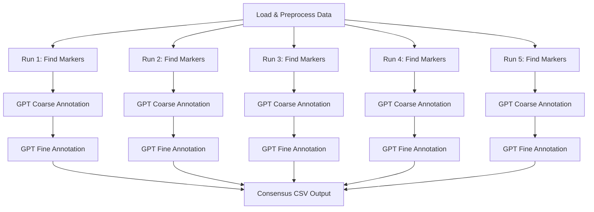
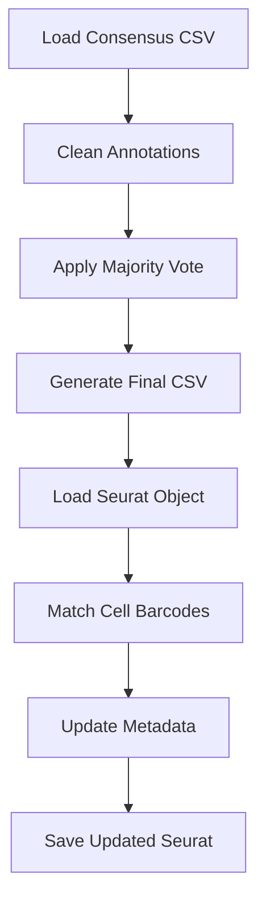

# 🧬 Hierarchical Cell Type Annotation with Consensus Analysis using GPT

> **A robust pipeline for single-cell RNA-seq annotation using GPT with 5-run consensus validation**

[](https://www.r-project.org/)
[](https://satijalab.org/seurat/)
[](https://openai.com/)

---

## 📋 Table of Contents

- [🎯 Overview](#-overview)
- [✨ Features](#-features)
- [📦 Requirements](#-requirements)
- [🚀 Quick Start](#-quick-start)
- [📚 Detailed Workflow](#-detailed-workflow)
- [⚙️ Configuration](#️-configuration)
- [📄 File Descriptions](#-file-descriptions)
- [🔧 Troubleshooting](#-troubleshooting)
- [📊 Example Output](#-example-output)

---

## 🎯 Overview

This pipeline performs **robust cell type annotation** for single-cell RNA-seq data by:

1. **Running 5 independent annotation iterations** with slight parameter variations
2. **Analyzing consensus** across all runs to determine final cell types
3. **Cleaning annotations** (removing numbers, artifacts)
4. **Updating Seurat objects** with final consensus annotations

The pipeline is **tissue-agnostic** and can be easily adapted for any single-cell dataset.

---

## ✨ Features

- 🔄 **5-Run Consensus**: Multiple annotation runs ensure robustness
- 🧹 **Auto-Cleaning**: Removes numbered annotations and artifacts
- 🎨 **Tissue-Agnostic**: Easy to adapt for any tissue type
- 📝 **Custom Prompts**: Support for custom ChatGPT prompts
- 🔗 **Seurat Integration**: Direct integration with Seurat objects
- 📊 **Detailed Reports**: Comprehensive summaries and statistics

---

## 📦 Requirements

### R Packages
```r
# Install required packages
install.packages(c("Seurat", "dplyr", "patchwork", "ggplot2"))

# Install GPTCelltype (if not already installed)
if (!require("GPTCelltype")) {
  devtools::install_github("Winnie09/GPTCelltype")
}

# Install OpenAI package
install.packages("openai")
```

### API Access
- **OpenAI API Key** with GPT-4 access
- Sufficient API credits for your dataset size

---

## 🚀 Quick Start

### Step 1: Configure Your Setup

1. **Set your OpenAI API key** in `hierarchical_annotation_clean.R`:
```r
Sys.setenv(OPENAI_API_KEY = "your-api-key-here")
```

2. **Update data paths** and tissue context:
```r
TISSUE_CONTEXT <- "human PBMC peripheral blood mononuclear cells"  # Modify for your tissue
TENX_DIR <- "path/to/your/10x/data"  # Update path
```

### Step 2: Run the Pipeline

```bash
# Step 1: Generate 5-run consensus data
Rscript hierarchical_annotation_clean.R

# Step 2: Analyze consensus and update Seurat object  
Rscript consensus_decision_and_update.R
```

### Step 3: Check Results

Your final files will be:
- `final_annotations.csv` - Clean consensus annotations
- `pbmc_final_annotated.rds` - Updated Seurat object

---

## 📚 Detailed Workflow

### 🔄 Phase 1: Multiple Annotation Runs

**Script:** `hierarchical_annotation_clean.R`

This script performs **5 independent annotation runs** with slight parameter variations to ensure robustness:



**Key Features:**
- 🎲 **Parameter Variation**: Slightly different `min.pct`, `logfc.threshold`, and `resolution` values
- 🔍 **Hierarchical Annotation**: Both coarse (major cell types) and fine (subtypes) levels
- 🧼 **Auto-Merging**: Combines numbered annotations (e.g., "T cells 1", "T cells 2" → "T cells")
- 💾 **Comprehensive Output**: Creates `consensus_annotations_TIMESTAMP.csv`

**Output Format:**
```csv
Cell_Barcode,Coarse_Run_1,Coarse_Run_2,Coarse_Run_3,Coarse_Run_4,Coarse_Run_5,Fine_Run_1,Fine_Run_2,Fine_Run_3,Fine_Run_4,Fine_Run_5
AAACATACAACCAC-1,T cells,T cells,Lymphocytes,T cells,T cells,CD4+ T cells,CD8+ T cells,T cells,T cells,CD4+ T cells
AAACATTGAGCTAC-1,B cells,B cells,B cells,B cells,B cells,Naive B cells,Memory B cells,B cells,B cells,Naive B cells
```

---

### 🧠 Phase 2: Consensus Analysis & Seurat Update

**Script:** `consensus_decision_and_update.R`

This script analyzes the consensus data and updates your Seurat object:



**Consensus Rules:**
1. **Majority Vote**: Most frequent annotation wins
2. **Annotation Cleaning**: Remove numbers and artifacts
3. **Quality Control**: Filter invalid annotations
4. **Conservative Approach**: Use "Unknown" when uncertain

**Output Files:**
- 📄 `final_annotations.csv` - Simple format: `barcode,coarse,fine`
- 💾 `pbmc_final_annotated.rds` - Updated Seurat object with new metadata

---

## ⚙️ Configuration

### 🎯 For Different Tissues

**Example 1: Liver Tissue**
```r
TISSUE_CONTEXT <- "human liver tissue hepatocytes and immune cells"
```

**Example 2: Brain Tissue**  
```r
TISSUE_CONTEXT <- "human brain cortex neurons and glial cells"
```

**Example 3: Tumor Tissue**
```r
TISSUE_CONTEXT <- "human breast tumor cancer cells and microenvironment"
```

### 📝 Custom Prompts

Create your own prompt file (`custom_prompt.txt`):

```text
CONSENSUS CELL TYPE ANNOTATION PROMPT FOR ChatGPT
====================================================

I have single-cell RNA-seq data from [YOUR TISSUE TYPE] with annotations from 5 runs.

**CONTEXT:**
- Data source: [YOUR SPECIFIC TISSUE/CONDITION]
- Expected cell types: [LIST YOUR EXPECTED CELL TYPES]

**DECISION RULES:**
1. MAJORITY CONSENSUS (≥3/5): Use the most frequent annotation
2. BIOLOGICAL SIMILARITY: Group related cell types  
3. QUALITY FILTER: Remove numbers, artifacts, gene names
4. CONSERVATIVE: Use "Unknown" when uncertain

**OUTPUT FORMAT:**
barcode,coarse,fine
```

Then update your script:
```r
PROMPT_FILE <- "custom_prompt.txt"
```

### 🔧 File Path Configuration

Update these paths in both scripts:

```r
# In hierarchical_annotation_clean.R
TENX_DIR <- "~/path/to/your/filtered_gene_bc_matrices"
TISSUE_CONTEXT <- "your tissue description"

# In consensus_decision_and_update.R  
CONSENSUS_CSV <- "consensus_annotations_TIMESTAMP.csv"
SEURAT_RDS <- "pbmc_annotated_TIMESTAMP.rds"
TISSUE_CONTEXT <- "your tissue description"  # Must match!
```

---

## 📄 File Descriptions

| File | Purpose | Input | Output |
|------|---------|-------|--------|
| `hierarchical_annotation_clean.R` | 5-run annotation pipeline | 10X data | `consensus_annotations_*.csv` |
| `consensus_decision_and_update.R` | Consensus analysis & Seurat update | Consensus CSV | `final_annotations.csv`, `pbmc_final_annotated.rds` |
| `chatgpt_consensus_prompt.txt` | ChatGPT prompt template | - | Text prompt |
| `test_cleaning.R` | Test annotation cleaning | - | Console output |

### 📊 Metadata Added to Seurat Object

After running the pipeline, your Seurat object will have:

```r
# New metadata columns
pbmc$celltype_consensus_coarse  # Major cell types (e.g., "T cells", "B cells")
pbmc$celltype_consensus_fine    # Cell subtypes (e.g., "CD4+ T cells", "Naive B cells")

# Example usage
DimPlot(pbmc, group.by = "celltype_consensus_coarse", label = TRUE)
DimPlot(pbmc, group.by = "celltype_consensus_fine", label = TRUE)
```

---

## 🔧 Troubleshooting

### ❌ Common Issues

**Issue 1: API Key Error**
```
Error: OpenAI API key not set
```
**Solution:** Set your API key properly:
```r
Sys.setenv(OPENAI_API_KEY = "sk-your-actual-key-here")
```

**Issue 2: File Not Found**
```
❌ Consensus CSV file not found: consensus_annotations_*.csv
```
**Solution:** Check the exact filename and update the path:
```r
CONSENSUS_CSV <- "consensus_annotations_20250615_161251.csv"  # Use actual filename
```

**Issue 3: No Seurat Object Match**
```
❌ No matching cell barcodes found
```
**Solution:** Ensure you're using the correct Seurat RDS file from the first script.

**Issue 4: Numbers in Annotations**
```
Lymphocytes 1, T cells 2, etc.
```
**Solution:** The cleaning functions automatically handle this! ✅

### 🧪 Testing Your Setup

Test the cleaning functionality:
```bash
Rscript test_cleaning.R
```

Expected output:
```
🧪 TESTING ANNOTATION CLEANING FUNCTION
========================================
Original → Cleaned
──────────────────────────────
'T cells 1'         → 'T cells'
'Lymphocytes 2'     → 'Lymphocytes'
'B cells 3'         → 'B cells'
✅ All numbered annotations have been cleaned!
```

---

## 📊 Example Output

### 📈 Console Output Summary

```
🎯 CONSENSUS ANNOTATION DECISION AND SEURAT UPDATE
============================================================

📥 STEP 1: Loading consensus data...
✅ Loaded 2693 cells from consensus_annotations_20250615_161251.csv

🧠 STEP 2: Making final annotation decisions...
Tissue context: human PBMC peripheral blood mononuclear cells
Found 5 coarse annotation columns
Found 5 fine annotation columns
Processing consensus for 2693 cells...
  Processed 500 cells...
  Processed 1000 cells...
  Processed 1500 cells...
  Processed 2000 cells...
  Processed 2500 cells...
✅ Consensus analysis completed

📄 PROMPT INFORMATION:
✅ Custom prompt loaded from: chatgpt_consensus_prompt.txt
🔧 Prompt configured for tissue: human PBMC peripheral blood mononuclear cells

📄 STEP 3: Creating final annotations CSV...
✅ All annotations are clean (no numbers found)
✅ Final annotations saved to: final_annotations.csv

📊 FINAL ANNOTATION SUMMARY:
Coarse annotations:
  Monocytes                :   651 cells (24.2%)
  Lymphocytes              :   637 cells (23.7%)
  T cells                  :   530 cells (19.7%)
  B cells                  :   350 cells (13.0%)
  CD8 T cells              :   320 cells (11.9%)
  NK cells                 :   159 cells (5.9%)
  Dendritic cells          :    32 cells (1.2%)
  Platelets                :    14 cells (0.5%)

Fine annotations:
  Non-classical Monocytes  :   401 cells (14.9%)
  Classical Monocytes      :   250 cells (9.3%)
  Interferon-stimulated T cells:   174 cells (6.5%)
  Activated B cells        :   170 cells (6.3%)
  Effector memory T cells  :   159 cells (5.9%)
  CD8 central memory T cells:   158 cells (5.9%)
  Plasmablast B cells      :   136 cells (5.1%)
  Effector memory CD8 T cells:   129 cells (4.8%)

🔄 STEP 4: Updating Seurat object...
Loading Seurat object from: pbmc_annotated_20250615_161251.rds
Original Seurat object: 2693 cells
Matched 2693 out of 2693 cells
✅ Updated Seurat object saved to: pbmc_final_annotated.rds

✅ CONSENSUS ANNOTATION PIPELINE COMPLETED!
```

### 📁 Final Output Files

```
your_project/
├── consensus_annotations_20250615_161251.csv    # 5-run raw data
├── final_annotations.csv                        # Clean consensus
├── pbmc_final_annotated.rds                    # Updated Seurat
└── annotation_run_*_*.rds                      # Individual runs
```

### 📋 final_annotations.csv Format

```csv
barcode,coarse,fine
AAACATACAACCAC-1,T cells,CD4+ T cells
AAACATTGAGCTAC-1,B cells,Naive B cells
AAACGCTTCTCTGTAT-1,Monocytes,Classical Monocytes
AAACGGGAACCGAA-1,NK cells,NK cells
AAACTTGAACCGAA-1,Dendritic cells,Myeloid dendritic cells
```

---

## 🎉 Success! 

Your pipeline is now complete! You have:

- ✅ **Robust annotations** from 5 independent runs
- ✅ **Clean, professional cell type names** (no numbers!)
- ✅ **Updated Seurat object** ready for downstream analysis
- ✅ **Consensus validation** ensuring annotation quality

### 🔬 Next Steps

```r
# Load your annotated data
pbmc <- readRDS("pbmc_final_annotated.rds")

# Visualize results
DimPlot(pbmc, group.by = "celltype_consensus_coarse", label = TRUE)
DimPlot(pbmc, group.by = "celltype_consensus_fine", label = TRUE)

# Continue with your analysis!
```

---

*Happy annotating! 🧬✨* 
